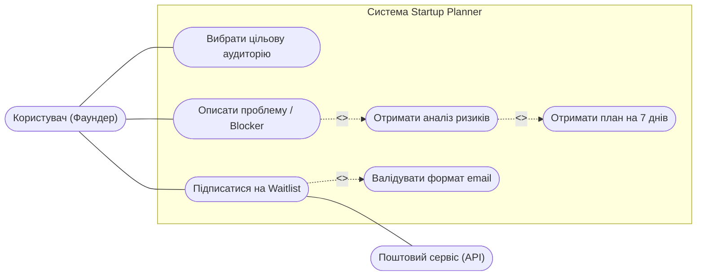
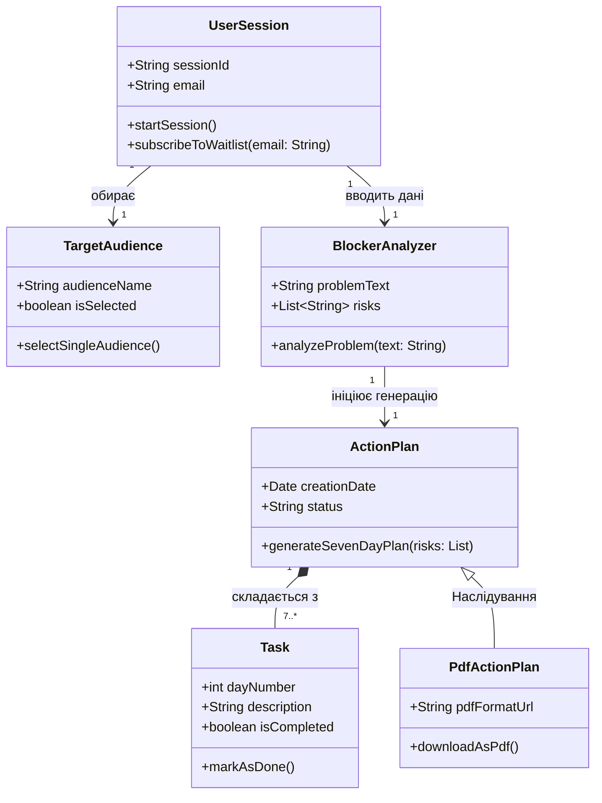
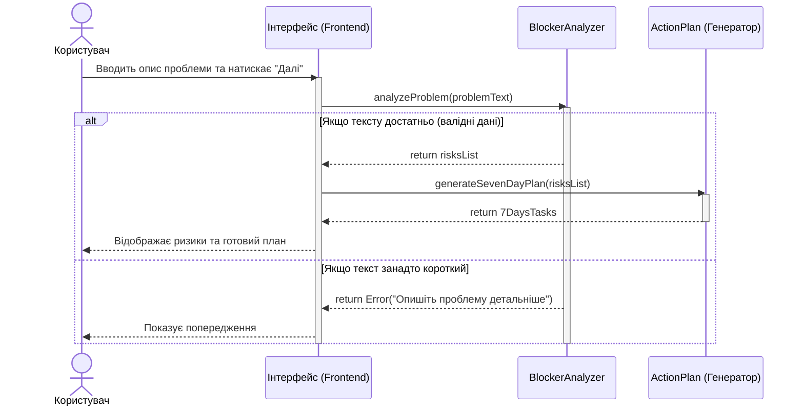

# Лабораторна робота: Моделювання вимог

**Проєкт:** Startup Planner
**Виконав:** Петрук Олександр

## Крок 1. Обрати проєкт
**Опис:** Startup Planner - веб-сервіс, який допомагає творцям стартапів сфокусуватися на одній цільовій аудиторії, зрозуміти свою найбільшу проблему та автоматично скласти чіткий план дій на тиждень.

## Крок 2. Функціональні вимоги (FR)
* **FR-01:** Користувач повинен мати можливість вибрати лише одну головну аудиторію (заборона множинного вибору).
* **FR-02:** На сайті має бути текстове поле для опису найбільшої проблеми користувача (Blocker).
* **FR-03:** Система повинна аналізувати введену проблему і показувати можливі ризики.
* **FR-04:** Система повинна автоматично генерувати готовий покроковий план завдань на найближчі 7 днів.
* **FR-05:** На головній сторінці має бути вікно для введення email, щоб підписатися на оновлення.
* **FR-06:** Система має автоматично перевіряти, чи правильно людина ввела email (наявність символу "@").

## Крок 3. Діаграма прецедентів (Use Case Diagram)

## Крок 4. Діаграма класів (Class Diagram)

## Крок 5. Діаграма послідовності (Sequence Diagram)

## Крок 6. Матриця трасовності (Traceability Matrix)

| Ідентифікатор вимоги (FR) | Прецедент (Use Case) | Задіяні класи (Classes) | Діаграма послідовності |
| :--- | :--- | :--- | :--- |
| **FR-01** | UC1 (Вибрати цільову аудиторію) | `UserSession`, `TargetAudience` | Ні |
| **FR-02** | UC2 (Описати проблему) | `UserSession`, `BlockerAnalyzer` | Так |
| **FR-03** | UC3 (Отримати аналіз ризиків) | `BlockerAnalyzer` | Так |
| **FR-04** | UC4 (Отримати план на 7 днів) | `ActionPlan`, `Task` | Так |
| **FR-05** | UC5 (Підписатися на Waitlist) | `UserSession` | Ні |
| **FR-06** | UC6 (Валідувати формат email) | `UserSession` | Ні |
